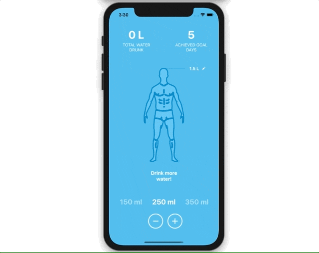

# Water Tracker
A simple React Native implementation for tracking water daily.



**Install packages:**
```
$ yarn install
$ cd ios && pod install && cd ..
```

**Run dev:**
```
$ yarn ios
$ yarn android
```

PS. I had hard time running and debugging on Android simulator on my computer therefore I am aware of some issues on Android but sadly it was not possible for me to move forward with them in the time that I can spare.